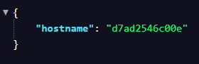
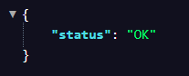

# TP Docker Swarm - GIRARD Lucas 5ESGI IW

## Configuration

### Prérequis

- Node.js 18+ 
- Docker et Docker Desktop (avec Swarm support)
- npm

### Installation locale

```bash
# Cloner le repository
git clone <repo-url>
cd tp-docker-swarm

# Installer les dépendances
npm install

# Lancer le serveur en développement
npm start

# Lancer les tests
npm test
```

Le serveur écoute sur `http://localhost:3000`

### API Endpoints

- `GET /` : Retourne le hostname du conteneur au format JSON
- `GET /health` : Retourne un statut OK pour les probes de santé

### Tests

```bash
npm test
```

Les tests vérifient :
- Le endpoint `/` retourne le hostname correct au format JSON
- Le endpoint `/health` retourne le statut OK avec le code HTTP 200

### Docker

#### Build et test local

```bash
# Build de l'image
docker build -t calulazone/tp-docker-swarm:latest .

# Test du conteneur en local
docker run -d -p 3000:3000 calulazone/tp-docker-swarm:latest

# Vérifier que c'est up
curl http://localhost:3000/health
```

#### Push vers Docker Hub

```bash
# Se connecter à Docker Hub
docker login

# Push l'image
docker push calulazone/tp-docker-swarm:latest
docker push calulazone/tp-docker-swarm:<SHA>
```

#### Déploiement sur la VM Swarm (GitHub Actions)

Le déploiement en production se fait **uniquement via GitHub Actions** :
- Push sur `main` déclenche le workflow
- Build et push automatique vers Docker Hub
- SSH + Tailscale pour se connecter à la VM Swarm
- `docker stack deploy` sur la VM avec les logs

**En résumé** :
- Local : `docker build` + `docker run` pour tester
- CI/CD : `docker build` + `docker push` + déploiement SSH sur VM

## Partie A - API Node.js

**Comment récupérez-vous le hostname dans Node.js ?**  
On récupère le hostname de cette façon : ```bash os.hostname()```

**Quelle différence entre “listening on [localhost](http://localhost)” et “0.0.0.0” dans un conteneur ?**
Localhost pointe uniquement vers la machine utilisée et est accessible que depuis l'intérieur du conteneur tandis que 0.0.0.0 écoute sur toutes les interfaces reseau du conteneur et peut être accessible depuis l'extérieur.

## Partie B - Conteneurisation Docker

**Quels fichiers doivent absolument être ignorés ? Pourquoi ?**  
Les fichiers à ignorer sont : 
- Les nodes modules car ils sont recréés dans l'image
- Le .env car c'est privé
- Les fichiers en lien avec Git

**Comment valider que votre image finale ne contient pas d’artefacts de dev ?**  
On peut par exécuter une commande et regarder ensuite la présence de ces artefacts. ```bash docker run --rm -it mon-image sh```.
On pourrait également utiliser un outil spécialisé comme Dive.

## Partie C - Registry d’images

**Quelle stratégie de tags adoptez-vous : latest, SHA, semver ?**  
On utilise latest et sha, latest pour développer/tester et sha pour déployer sur Swarm

**Pourquoi un tag immuable est préférable pour un déploiement fiable ?**  
Un tag immuable comme le SHA garantit que chaque nœud Swarm pull exactement la même image, peu importe le moment. Cela rend les déploiements reproductibles et les rollbacks précis.

## Partie D - Accès distant au cluster Swarm

```
GitHub (push main)
        |
        v
GitHub Actions
        |
        |-- 1. Build & Push --> Docker Hub
        |-- 2. Tests Jest
        |-- 3. SSH via Tailscale --> VM Swarm
                                        |
                                        v
                                docker service update
                                        |
                                        v
                                pull image depuis Docker Hub
                                service tourne sur port 3000
```

### Authentification

**GitHub Actions -> Docker Hub**
- Access Token Docker Hub stocké dans GitHub Secrets (`DOCKERHUB_TOKEN`)
- Username Docker Hub (`DOCKERHUB_USERNAME`)

**GitHub Actions -> VM Swarm**
- Authkey Tailscale (`TAILSCALE_AUTHKEY`)
- Clé privée SSH (`SSH_PRIVATE_KEY`)
- Host SSH (`SSH_HOST`, ex: IP ou domaine de la VM)
- Clé publique dans `~/.ssh/authorized_keys` sur la VM (utilisateur `vboxuser`)

**Swarm -> Docker Hub**
- Registre public

### Ports exposés

| Port | Service | Exposition |
|------|---------|------------|
| 3000 | Application Node.js | Swarm ingress |
| 22 | SSH | Tailscale uniquement |

### Risques et mitigations

| Risque | Mitigation |
|--------|------------|
| Secrets dans l'image | `.dockerignore` + variables injectées au runtime |
| Tag `latest` mutable | Déploiement par SHA de commit |
| SSH exposé publiquement | SSH accessible via Tailscale uniquement |
| Conteneur en root | User non-root `nextjs` (uid 1001) |


**Pourquoi exposer Docker en TCP sans TLS est dangereux ?**  
Si le daemon Docker est exposé en TCP sans TLS,
n'importe qui pouvant atteindre ce port obtient un accès root complet à la machine,
sans aucune authentification.

**Runner atteint le manager vs Manager atteint le runner**
Dans notre approche, c'est le runner GitHub Actions qui initie la connexion SSH
vers la VM. La VM n'expose aucun port public et n'a pas besoin de connaître GitHub.
Dans le sens inverse, la VM devrait exposer une API accessible
depuis GitHub, ce qui augmente la surface d'attaque.
On préfère donc que la CI pousse vers la VM.

## Partie E - Définir une stack Swarm

**Comment Swarm gère-t-il un rolling update ?**  
Swarm effectue un rolling update en remplaçant les conteneurs un par un (ou par lots selon le paramètre `parallelism`). Pour chaque conteneur, il arrête l'ancien, démarre le nouveau avec la nouvelle image, attend que le healthcheck passe, puis passe au suivant.

**Que se passe-t-il si le healthcheck échoue pendant l’update ?**  
Si le healthcheck échoue pendant l'update, Swarm peut soit rollback (revenir à l'ancienne version) si `failure_action` est défini à `rollback`, soit pause l'update si défini à `pause`, ou continuer selon la configuration. Dans notre cas, `failure_action: rollback` permet de revenir automatiquement à la version précédente en cas d'échec.


## Partie F — Améliorations CI/CD

**Comment éviter d’afficher des secrets dans les logs ?**  
Les secrets GitHub Actions sont automatiquement masqués dans les logs s'ils sont référencés via `${{ secrets.SECRET_NAME }}`. Il faut notamment utiliser des variables d'environnement (`env: SECRET: ${{ secrets.SECRET }}`) où l'on peut.

**Comment valider automatiquement que le service est “UP” après deploy (smoke test) ?**  
On pourrait ajouter une autre étape qui fait un `curl` vers l'endpoint de health (`http://localhost:3000/health`) et qui vérifie que la réponse est un JSON valide avec `status: "OK"` et code HTTP 200. J'ai essayé mais je n'arrivait pas à récupérer la réponse.


## Partie G — Validation (tests à fournir)

### Tests fonctionnels

Les tests Jest existants (`npm test`) valident automatiquement les endpoints :
- `GET /health` : Vérifie le code 200 et la réponse JSON `{ status: "OK" }`
- `GET /` : Vérifie le code 200, le format JSON et la présence du champ `hostname`

Exécuter `npm test` pour lancer les tests fonctionnels.

### Observabilité minimale

**Convention de logs** : `console.log` pour logger les requêtes entrantes (ex: `console.log(\`[${new Date().toISOString()}] GET /\`);`). Les logs sont visibles via `docker service logs tp-swarm_api`.

**Inspection de l'état du service** : Utilise les commandes Docker Swarm :
  - `docker service ls` : Liste des services et leur état
  - `docker service ps tp-swarm_api` : État des tâches/réplicas
  - `docker service logs tp-swarm_api` : Logs des conteneurs

## Preuve de fonctionnement

### Stack déployée

```
$ docker service ls
ID             NAME           MODE         REPLICAS   IMAGE                               PORTS
fexz2ckn9one   tp-swarm_api   replicated   3/3        calulazone/tp-docker-swarm:latest   *:3000->3000/tcp
```

### Tâches en cours d'exécution

```

CONTAINER ID   IMAGE                               COMMAND                  CREATED          STATUS                    PORTS      NAMES
0923e058555b   calulazone/tp-docker-swarm:latest   "docker-entrypoint.s…"   25 minutes ago   Up 25 minutes (healthy)   3000/tcp   tp-swarm_api.1.ekn46rm15xoko3y8auc4mm9xr
d7ad2546c00e   calulazone/tp-docker-swarm:latest   "docker-entrypoint.s…"   25 minutes ago   Up 25 minutes (healthy)   3000/tcp   tp-swarm_api.2.8wc9ikev14t5g35xibnrk2qcj
7330ec6b6571   calulazone/tp-docker-swarm:latest   "docker-entrypoint.s…"   25 minutes ago   Up 25 minutes (healthy)   3000/tcp   tp-swarm_api.3.rfed382jlrhp98pxrf385nxad
```

### Appel HTTP GET /



Résultat : Le service retourne le hostname du conteneur en JSON.

### Appel HTTP GET /health



Résultat : Le service retourne un statut OK (code 200).